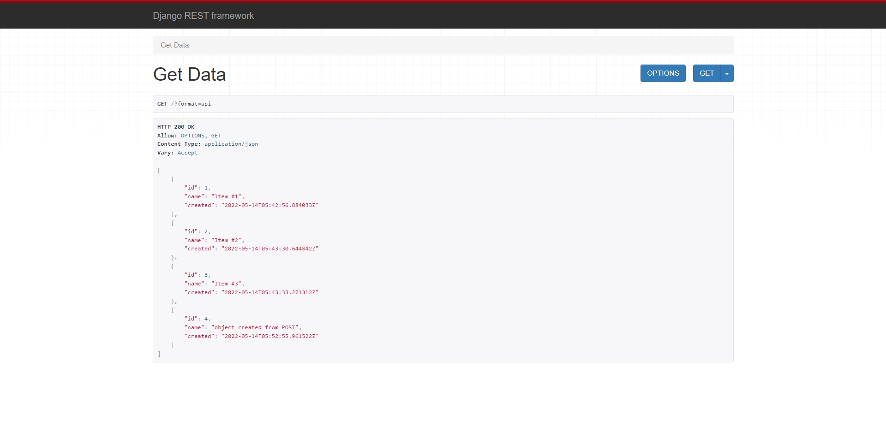
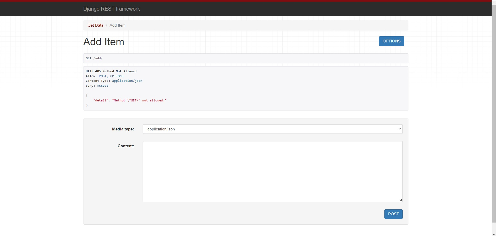

# Aditya Raj

## Table of Contents
* [General Info](#general-information)
* [Technologies Used](#technologies-used)
* [Features](#features)
* [Screenshots](#screenshots)
* [Setup](#setup)
* [Project Status](#project-status)
* [Contact](#contact)

## General Information
An API built on Django-REST framework. This API records values like names and creation datetime and is saved to database.

## Technologies Used
- Python
- Django-REST Framework
-SQLite

## Features
- Simple UI
- Output in Json or API format

## Screenshots



### Cloning the repository

--> Clone the repository using the command below :
```bash
git clone https://github.com/adityaraj-mishra/.git

```

--> Move into the directory where we have the project files : 
```bash
cd 

```

--> Create a virtual environment :
```bash
# Let's install virtualenv first
pip install virtualenv

# Then we create our virtual environment
virtualenv envname

```

--> Activate the virtual environment :
```bash
envname\scripts\activate

```

--> Install the requirements :
```bash
pip install -r requirements.txt

```

#

### Running the App

--> To run the App, we use :
```bash
python manage.py runserver

```
--> To add the data, use url :
```bash
http://127.0.0.1:8000/add/

```
> ⚠ Then, the development server will be started at http://127.0.0.1:8000/

#


## Project Status
 _completed_

## Deployment
_not-for-deployment_

## Contact
- Project By: **Aditya Raj**.
- <a href="mailto:araj.mishra2000@gmail.com">Email Me</a>